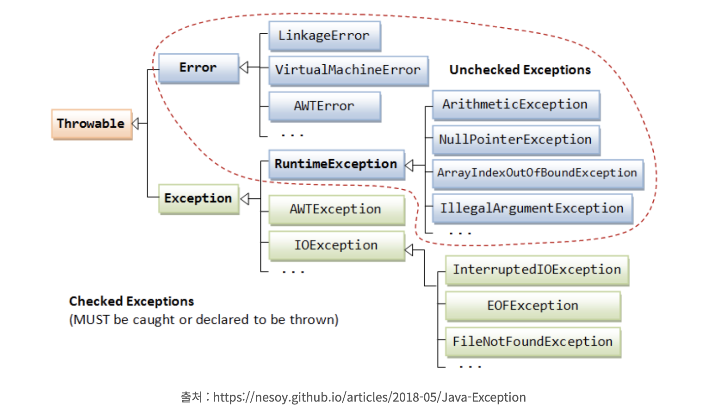

## 예외 처리

- **예외**는 프로그램 실행 중에 발생하는 비정상적인 상황이다. 
- 자바는 실행 중에 발생할 수 있는 비정상적인 상황을 다음 두 가지로 구분한다.
  1. **에러(Error)**: 메모리가 부족하거나 스택이 가득 찬 정도의 치명적인 상황이며 복구 불가능하여 더 이상 실행을 계속할 수 없다. 
  2. **예외(Exception)**: 일고자 하는 파일이 없거나 계산식을 수행할 수 없는 정도의 경미한 오류이며, 오류 조건을 제거하면 계속 실행할 수 있다. 
- 즉, 예외는 발생 조건을 미리 걸러낸다거나 발생한 후에 조치할 수 있다. 
- 안정적인 프로그램은 어떠한 상황에서도 계속 실행할 수 있도록 발생 가능한 모든 예외를 적절히 처리해야 한다.
- 예외 블록의 기본 형식은 다음과 같다.
  1. 예외 발생 가능성이 있는 코드를 try 블록으로 감싼다.
  2. 실행 중에 예외가 발생하면 catch 블록으로 점프하여 어떤 예외가 발생했는지 예외 객체가 전달된다.
  3. finally 블록에는 예외 발생과 상관없이 항상 실행할 코드를 작성하는데 필요 없을 시 생략한다.
     a. 주로 리소스 해제 코드를 작성하는데 가비지 컬렉터가 메모리를 관리하므로 finally 블록을 사용하는 경우는 흔하지 않다.

```java
try {
    예외가 발생할 만한 코드 
        }
catch (예외 객체){
    예외 처리
        }
finally {
    리소스 해제
        }
```

<br>

- 예외 발생 전에 선제적으로 조건을 점검하여 예외를 일으키는 코드를 실행하지 않도록 해야 하며 예외 발생 지점에서 즉시 점검해야 한다. 
- 예외처리를 통해 일반적인 조건문과 예외 처리 구문이 확실하게 분리되어 코드의 구조가 향상되고 유지 보수에도 유리하다.

<br>

### 1. 예외 객체 

- 자바의 예외 클래스 계층은 다음과 같다. 



<br>

- 다음 메소드는 예외가 발생한 원인을 문자열로 리턴한다. 

```java
String getMessage()
```

> 참고 파일: `exmessage.java`

<br>

### 2. 여러 개의 예외 처리 

- 여러 가지 예외가 동시에 발생할 수 있는 상황이라면 예외의 종류에 따라 여러 개의 catch 블록을 나열한다.
  - 참고: `MultiCatch.java`
- 예외 객체 간에도 다형성이 성립되어 부모 타입의 예외 객체가 자식 타입의 예외 객체를 받을 수 있다. 
- `ArithmeticException`이나 `ArrayIndexOutOfBoundsException`은 `RuntimeException`의 자식이므로 두 예외를 하나의 catch 블록으로 처리해도 된다.
  - 참고 파일: `Polyex.java`
- 예외 블록이 catch 문을 찾는 방법은 switch case 문과 비슷하다.
  - 그래서 catch 블록은 가급적 위쪽에 특수한 예외를 배치하고 뒤로 갈수록 일반적인 예외를 처리한다.

<br>

### 3. 메소드 간의 예외 전달 

- 예외 처리 구문은 조건문과 달리 메소드 호출 간에도 처리된다.
- 메소드 호출 단계는 스택에 기록되는데 `pirintStackTrace` 메소드는 이 정보를 읽어 예외 발생 시의 호출 스택 상태를 출력한다.

<br>

### 4. 사용자 정의 예외 

- throw 구문으로 예외 객체를 생성하여 던지며 예외 객체의 생성자로 설명 문자열을 제공한다.
  - 정상적인 실행을 계속하기 어려운 어쩔 수 없는 상황에서 예외를 발생시키므로 보통은 if 조건문이나 다른 예외 처리 구문에서 예외를 던진다.
- 즉, 메소드가 예외를 던지는 것은 직접 처리하지 않고 상위의 호출원에게 예외에 대한 처리를 부탁하는 것이다. 
- `Throw3.java`에서 printScore 메소드는 name이 null일 경우 자신이 직접 처리하지 않는다.
  - 대신 예외 객체를 생성하여 throw 구문으로 던져 호출원에게 어떤 예외가 발생했는지 알리고 처리를 위임한다.
  - 이렇게 안하고 `Throw2.java`일 경우 printScore가 전달받은 인수를 사용해 연산할 때 애초에 인수가 잘못 전달되었으면 내부에서 조치를 취할 방법이 없다.
  - 이럴 때는 예외를 상위의 메소드로 던져 뭔가 잘못되었음을 알려야 한다. 
- 예외를 덜지는 메소드는 선언문 뒤쪽에 throws 절로 어떤 예외를 던지는지 명시한다.
- 여러 개의 예외를 던질 때는 콤마로 구분하여 발생 가능한 모든 예외를 나열한다.
- throws 구문은 이 메소드 실행 중에 발생 가능한 예외를 명시하며 호출원은 이 예외를 반드시 처리해야 한다.
- main에서는 printScore 메소드 호출문을 try 블록으로 감싸고 NullPointerException 예외를 잡아 처리하였다. 
- checked 예외는 가상 머신이 받기 전에 누군가가 처리해야 정상적인 실행을 계속할 수 있다. 
- throws에 명시된 예외는 직접 처리하거나 아니면 상위로 던져 처리를 위임해야 한다. 

<br>

### 5. 사용자 정의 예외 

- 개발 과정에서 발생할 수 있는 대부분의 예외는 자바 라이브러리가 이미 정의해 놓았다.
- 그러나 프로그램 고유의 논리에 의해 발생하는 예외는 가상 머신이 알아낼 수 있다.


<br>

### 6. finally

- finally 블록은 예외와 상관없이 항상 실행할 코드를 작성한다. 
- 할당한 자원을 해제하는 정리 코드를 작성하는데 메모리는 가비지 컬렉터에 의해 자동으로 수집되므로 주로 비메모리 자원을 해제하는 용도로 사용된다.


